# Active Directory Runbook

**Name of the new hire:** Toby Flenderson  
**Role at StackFull Software:** Social Media Associate  
**Department:** HR

---

This runbook outlines a series of tasks related to user and group management, file sharing, OU creation, GPO configuration, and system monitoring for a Windows domain environment.

---

## 🧩 Full Setup Process

### Step 1: Join the Computer to the Domain
Log in using the local administrator account (`administrator` / `Pa$$w0rd`). Open Control Panel > System and Security > System. Click "Change settings" to open System Properties. In the Computer Name tab, click "Change...", select "Domain", and type `contoso.com`. When prompted, enter domain credentials. Once successful, restart the computer to apply the domain join.

  
  
  
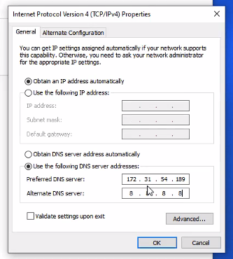  
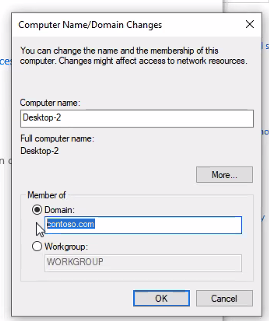

---

### Step 2: Create a New User in Active Directory
On the server, open **Active Directory Users and Computers**. Navigate to `contoso.com > Users`, right-click the folder, and select `New > User`. Fill in the user's full name, username, and password settings. Complete the wizard.

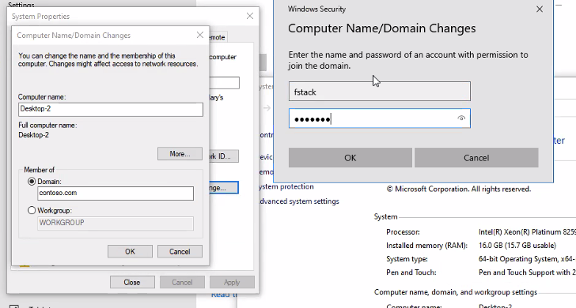  
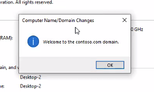  
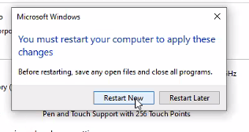  
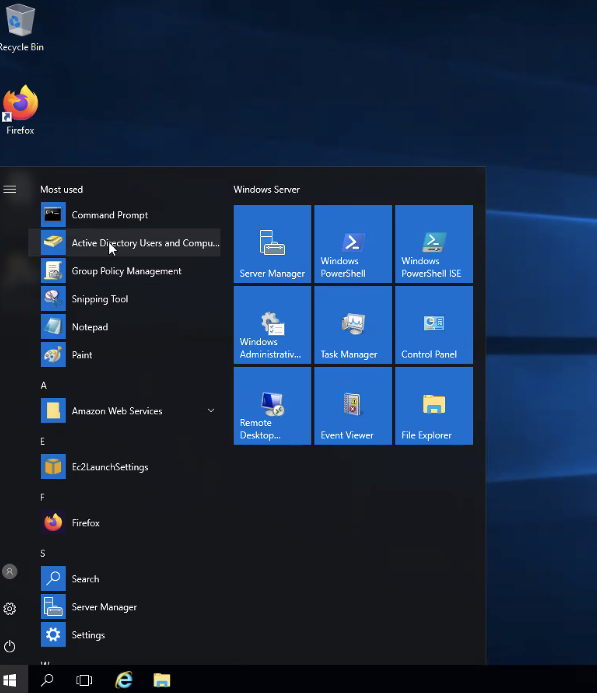  
  


---

### Step 3: Create a Security Group
In Computer Management, expand Local Users and Groups > Groups. Right-click Groups and select New Group. Name the group (e.g., HR), then add the new user to the group.

  
  
  


---

### Step 4: Create a Network Share
On the file server, create a new folder. Right-click it > Properties > Sharing > Advanced Sharing. Share the folder and grant permissions to the HR group. Confirm sharing is active by creating a file inside.

  
  
  
  
  


---

### Step 5: Create an OU and Move Objects
Back in ADUC, create an Organizational Unit (OU) under the domain root. Move the user and group objects into this OU. This will help with group policy targeting.

  
  
  


---

### Step 6: Apply GPO Settings to the OU
Open Group Policy Management. Create and link a new GPO to the HR OU.

#### Set a Startup Message
Edit the GPO > Computer Configuration > Policies > Windows Settings > Security Settings > Local Policies > Security Options. Modify the login message fields.

  
  


#### Disable Command Prompt
Navigate to: User Configuration > Admin Templates > System > Prevent access to command prompt. Enable the policy.

  


#### Add a Logon Script
Under User Configuration > Windows Settings > Scripts (Logon/Logoff), add a `.bat` file to map the HR share.

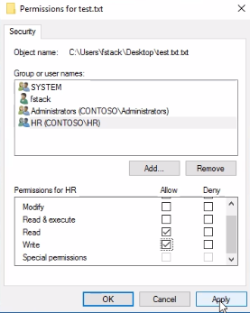  
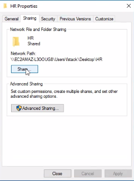  
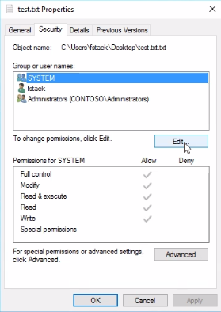

#### Remove the Run Menu
Under User Configuration > Admin Templates > Start Menu and Taskbar > Remove Run menu. Enable this policy.

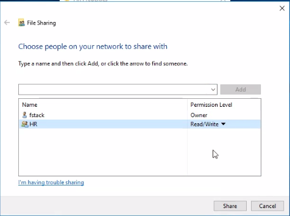  
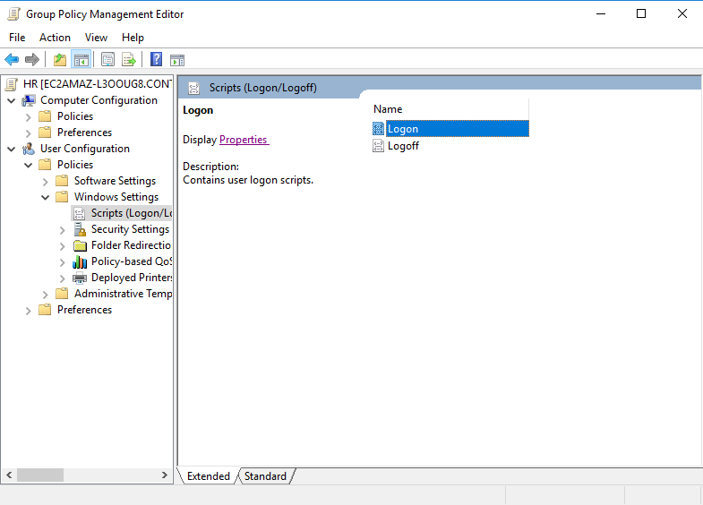

---

### Step 7: Review Login Events
Open Event Viewer > Windows Logs > Security. Filter for Event ID 4624 (successful logon). Look for the new user’s logins.

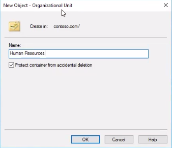  
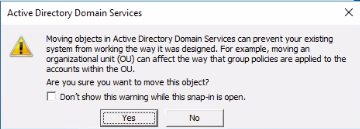

---

### Step 8: Use PowerShell to Check Software Installations
```powershell
Get-WmiObject -Class Win32_Product |
  Sort-Object InstallDate -Descending |
  Select-Object Name, Version, InstallDate -First 1
```
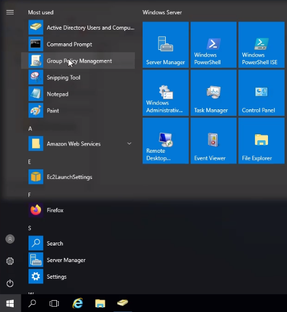

---

### Step 9: List Running Services with PowerShell
```powershell
Get-Service |
  Where-Object {$_.Status -eq "Running"} |
  Out-File "running_services.txt"
```
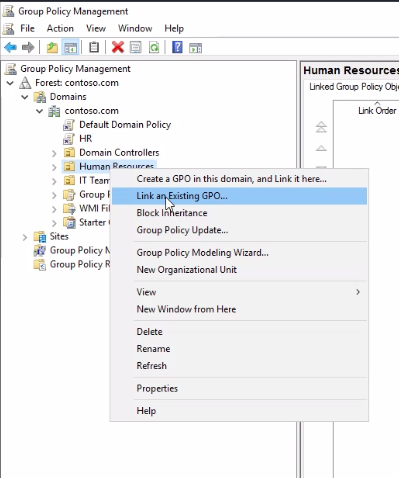

---

### Step 10: Map the HR Share via GPO Script
Return to the logon script section in GPO. Use the Show Files button to open the script folder. Place your `.bat` file inside and configure it to run at user logon.

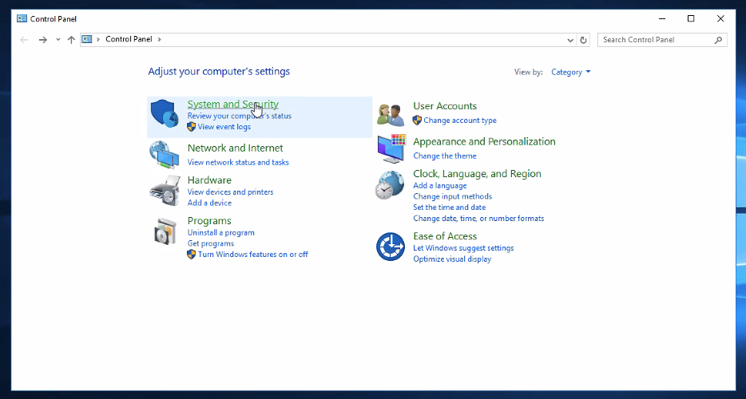  
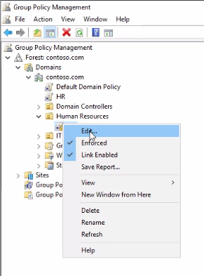  
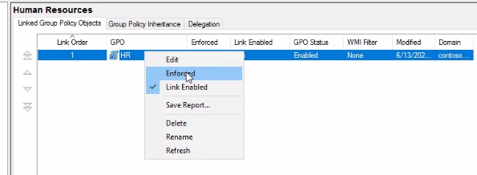  
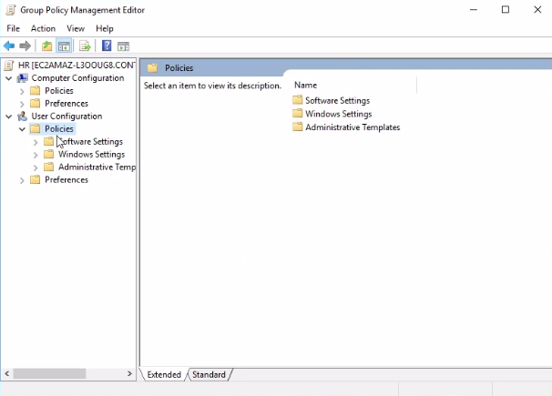  
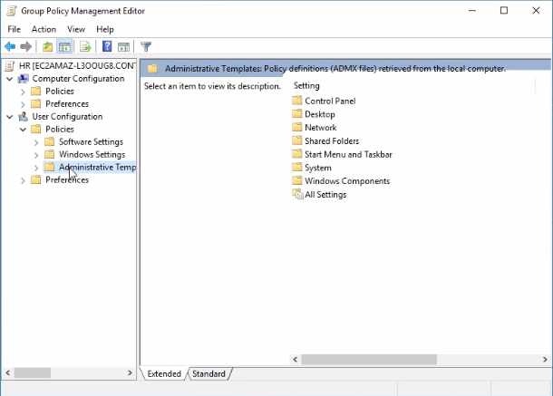  
  
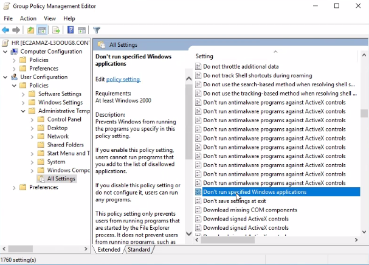

---

### Step 11: Disable Run Menu via Policy
Navigate to the Run command removal setting and enforce the GPO.

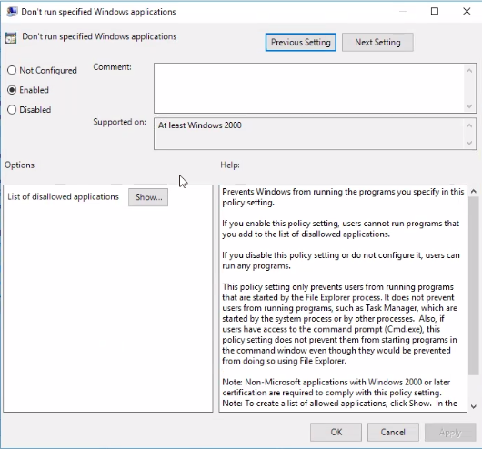  
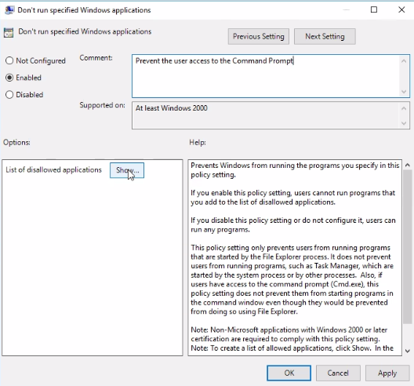  
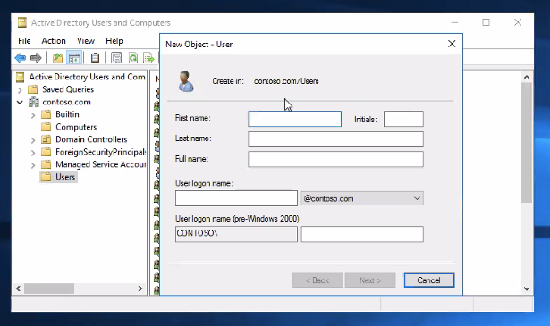  
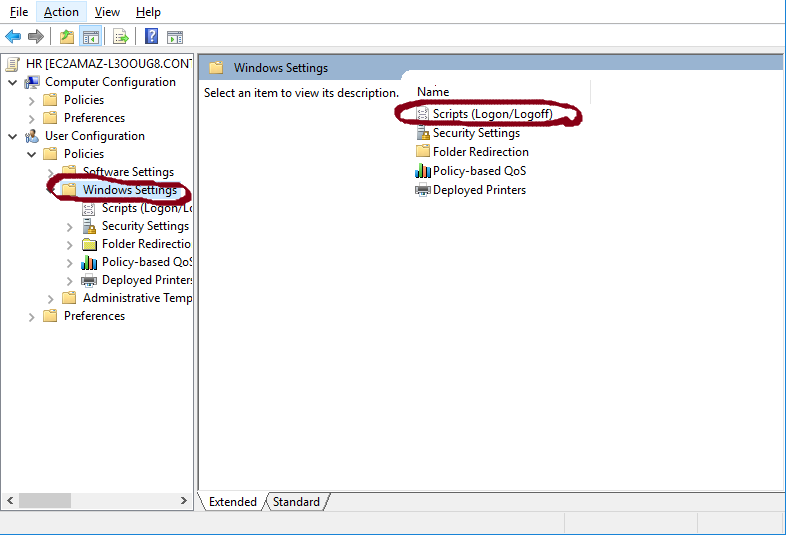

---

### Step 12: Final GPO and OU Verification
Verify that the policies are applying properly and the OU structure is correct.

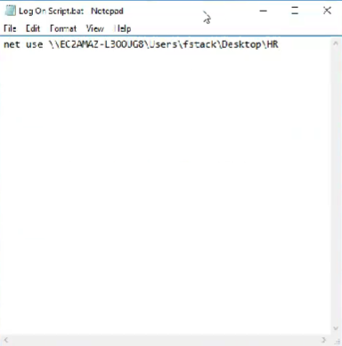  
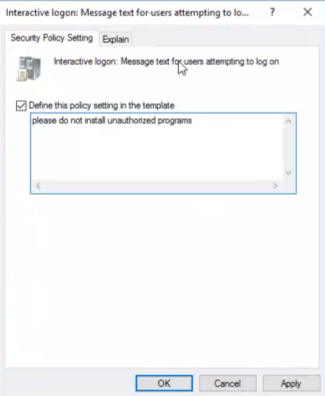

---

### Step 13: Additional Screens and Validation Logs
This section includes extra screenshots verifying results, testing configuration, and demonstrating expected output.


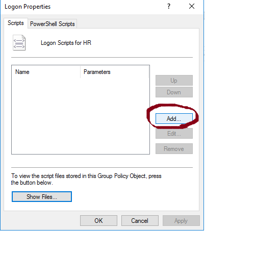
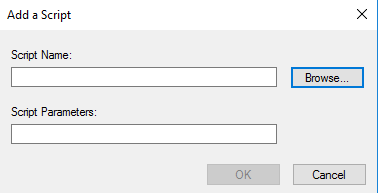
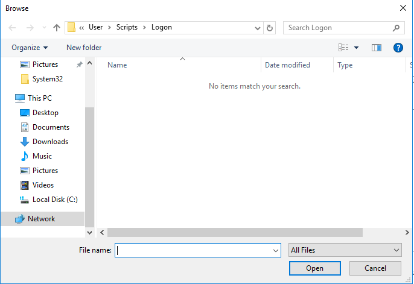
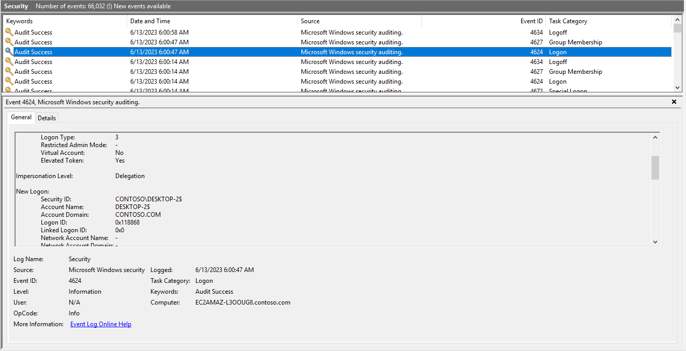
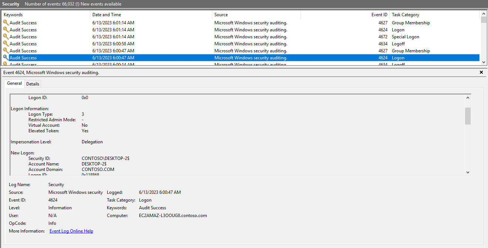


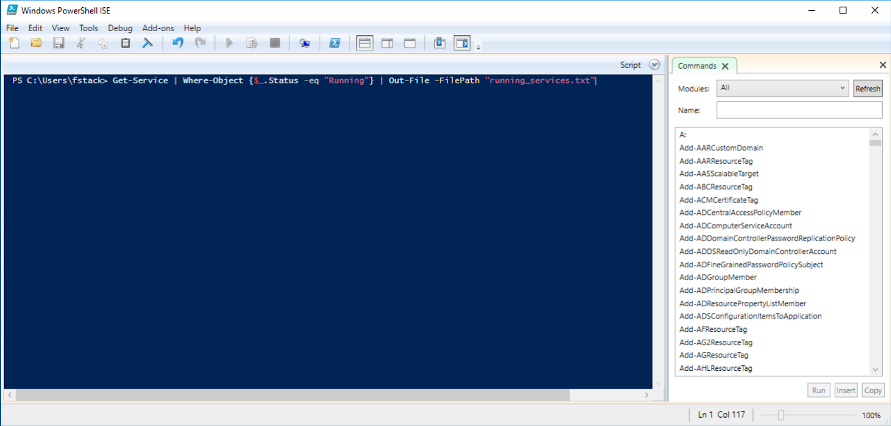
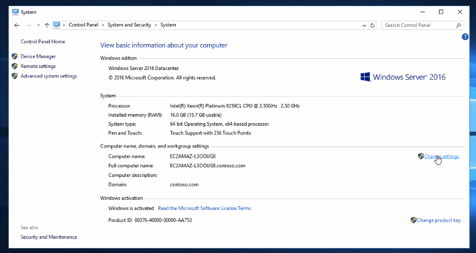

---

This concludes the full setup. The steps above ensure domain security, efficient onboarding, and proper system monitoring.
