# Active Directory Runbook

**Name of the new hire:** Toby Flenderson  
**Role at StackFull Software:** Social Media Associate  
**Department:** HR

---

The following runbook outlines a series of steps to be executed in order to perform various tasks related to user and group management, file sharing, organizational unit (OU) creation, Group Policy Object (GPO) configuration, and system monitoring. These steps are aimed at setting up and managing a domain environment, ensuring security measures are in place, and enabling efficient user management.

---

## 🖥️ Step 1: Join the Computer to the Domain
This step involves joining a computer to the “contoso.com” domain using the provided administrator credentials.

1. Log in to the computer using the username `administrator` and the password `Pa$$w0rd`.
2. Open the Control Panel and navigate to `System and Security > System`.
3. Click on `Change settings` next to the computer name.
4. In the System Properties window, click on the `Change` button.
5. Select the `Domain` option, enter `contoso.com` as the domain name, and click `OK`.
6. Provide the administrator credentials for the domain when prompted.
7. Restart the computer for the changes to take effect.

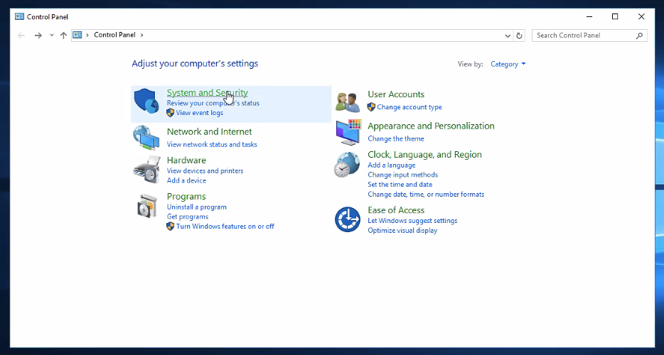  
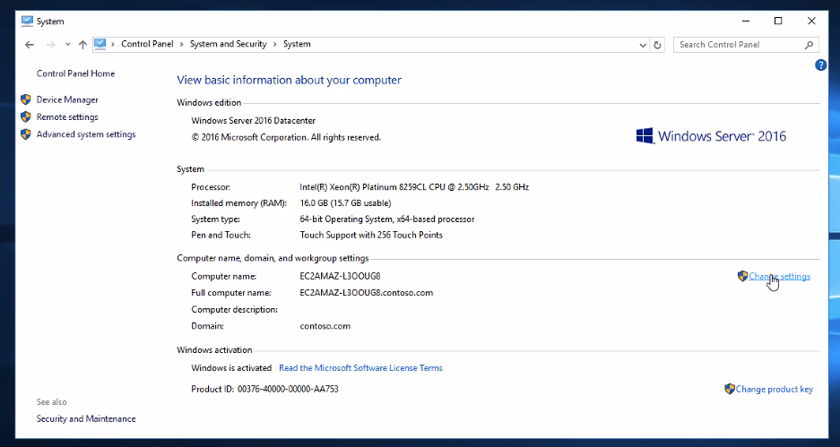

---

## 👤 Step 2: Create a User for the New Hire
Switching to the server, a new user account is created for the new hire, and a password is set for the account.

1. Switch to the server machine.
2. Log in as an administrator with appropriate permissions.
3. In the search box, type `Active Directory Users and Computers` and open the program.
4. On the left side panel, click on `contoso.com`
5. Go into the `Users` folder and create a user for Toby Flenderson.
6. Enter the necessary details for the new hire’s user account, including username and password.
7. Click `Finish` to create the user account.

  
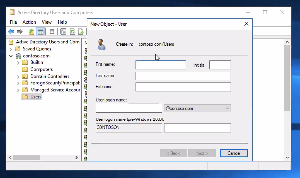  
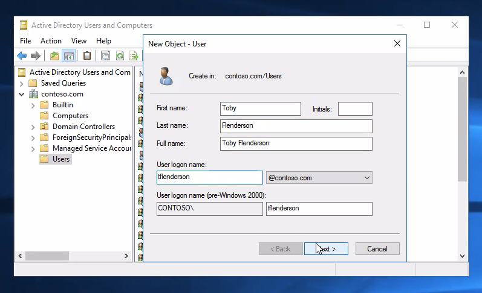  
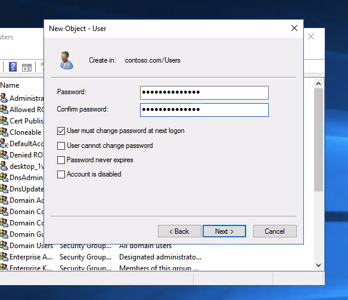

---

## 👥 Step 3: Create a Group with the Department Name
A group is created with the name of the department, allowing for better organization and management of users.

1. In the `Computer Management` console, expand `Local Users and Groups` and navigate to `Groups`.
2. Right-click in the right-hand pane and select `New Group`.
3. Enter the department name as the group name and click `Create`.
4. Double-click the newly created group to open its properties.
5. Click on the `Add` button and enter the username of the new hire.
6. Click `OK` to add the user to the group.

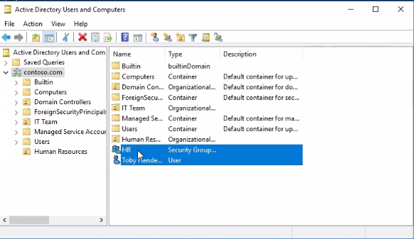  
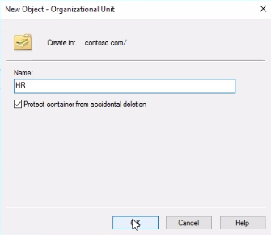  
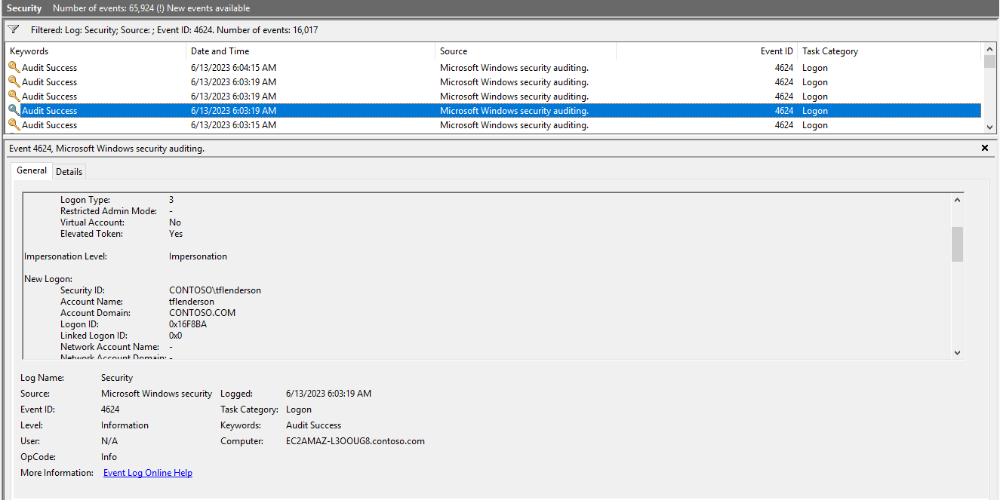

---

## 📁 Step 4: Create a Share on the Server
A share is created on the server, named after the department, and limited to users belonging to that department. The share has read and write permissions, and a text document called `test.txt` is created within the folder.

1. Open File Explorer on the server machine.
2. Navigate to the desired location where the department share should be created.
3. Right-click on the folder and select `Properties`.
4. In the `Properties` window, go to the `Sharing` tab.
5. Click on the `Share` button and enter the department name as the share name.
6. Configure the share permissions to allow read and write access only to the group created in Step 3.
7. Click `OK` to create the share.
8. Open the newly created share and create a text document called `test.txt`

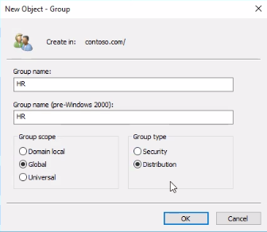  
  
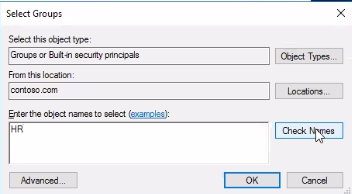

---

## 🗂️ Step 5: Create an OU with the Department Name

1. Open the `Active Directory Users and Computers` console on the server machine.
2. Right-click on the domain name and select `New > Organizational Unit`.
3. Enter the department name as the OU name and click `OK`.
4. Move the user, group, and computer objects to the newly created OU.
5. Create or locate a Group Policy Object (GPO) that contains the desired settings.
6. Right-click on the OU and select `Link an Existing GPO`.
7. Choose the appropriate GPO and click `OK` to link it to the OU.

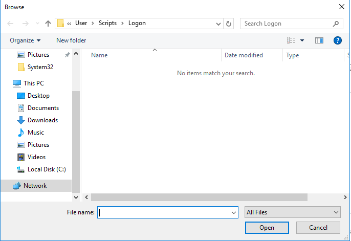  
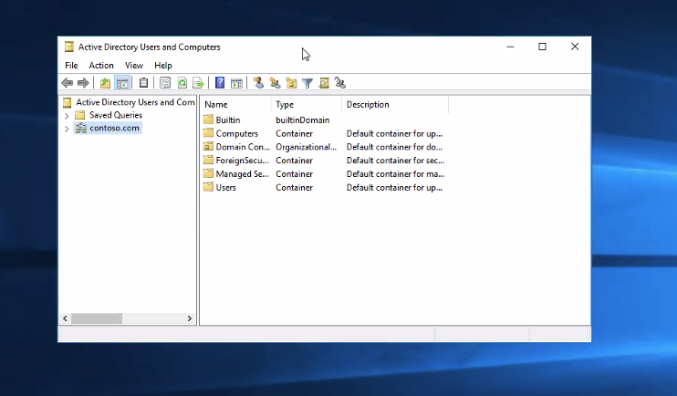

---

## 🛡️ Step 6: Edit the GPO and Apply Specific Rules

### A. Display a Startup Message
1. Open the Group Policy Management Console (GPMC).
2. Create or select a GPO.
3. Right-click and choose `Edit`.
4. Navigate to `Computer Configuration > Policies > Windows Settings > Security Settings > Local Policies > Security Options`.
5. Locate `User Account Control: Run all administrators in Admin Approval Mode`.
6. Set the policy to `Enabled`.
7. Apply the GPO to the relevant OU.

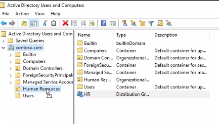

### B. Restrict Access to Command Prompt
1. Navigate to `User Configuration > Policies > Administrative Templates > System`.
2. Enable the `Prevent access to the command prompt` policy.

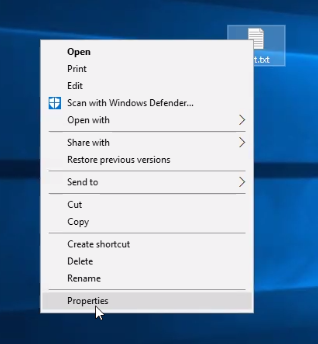

### C. Add a Logon Script
1. Navigate to `User Configuration > Policies > Windows Settings > Scripts (Logon/Logoff)`.
2. Double-click `Logon`.
3. Click `Show Files` and add your `.bat` script.
4. Click `Add` and select the script.

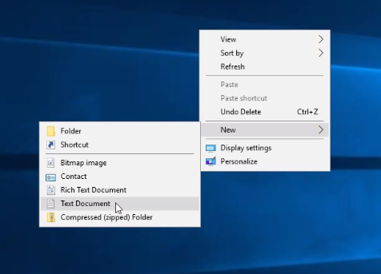  
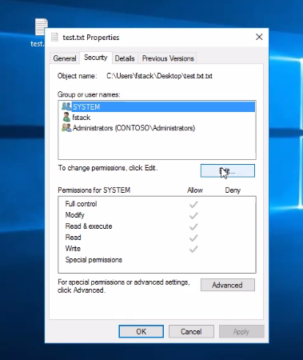

### D. Disable the Run Command
1. Navigate to `User Configuration > Policies > Administrative Templates > Start Menu and Taskbar`.
2. Enable `Remove Run menu from Start Menu`.


---

## 📊 Step 7: Check the Event Viewer for Last Login
Using the domain administrator account, open the Event Viewer on the server machine to determine the timestamp of the last successful login by the specified user.

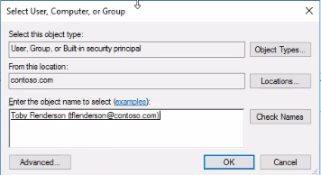

---

## 💻 Step 8: Use PowerShell to Check the Latest Installed Program
```powershell
Get-WmiObject -Class Win32_Product |
  Sort-Object InstallDate -Descending |
  Select-Object Name, Version, InstallDate -First 1
```

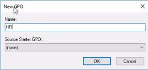

---

## ⚙️ Step 9: Write a PowerShell Script to List Running Services
```powershell
Get-Service |
  Where-Object {$_.Status -eq "Running"} |
  Out-File "running_services.txt"
```

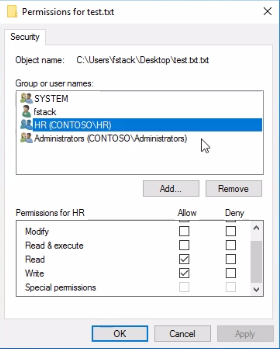

---

By following these steps, the runbook facilitates the setup and management of a domain environment, enforces security measures, monitors system activity, and streamlines user and group management within the specified department.
