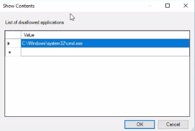
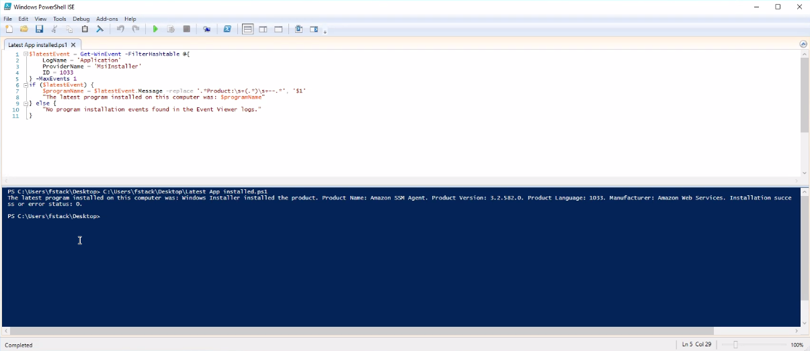

# Active Directory Runbook

**Name of the new hire:** Toby Flenderson  
**Role at StackFull Software:** Social Media Associate  
**Department:** HR

---

This runbook outlines a series of tasks related to user and group management, file sharing, OU creation, GPO configuration, and system monitoring for a Windows domain environment.

---

## 🧩 Full Setup Process

### Step 1: Join the Computer to the Domain
Log in using the local administrator account (`administrator` / `Pa$$w0rd`).

Open Control Panel > System and Security > System.  


Click "Change settings" to open System Properties.  


In the Computer Name tab, click "Change..."  


Select "Domain" and enter `contoso.com`.  


Enter domain credentials when prompted.  


Once successfully joined, you will be prompted to restart the system to apply changes. Restart the computer to complete the process.

---

### Step 2: Create a New User in Active Directory
Log in to the domain controller or a computer with administrative tools.

Open the **Active Directory Users and Computers** console.  


Expand your domain (e.g., `contoso.com`) and navigate to the **Users** container.  


Right-click the **Users** container and choose **New > User**.  


Enter the user's first name, last name, and user logon name (e.g., tflenderson).  


Set an initial password and configure appropriate password options.  


Click **Finish** to complete user creation.  


You should now see the newly created user listed in the **Users** container.

---

### Step 3: Create a Security Group
To manage permissions using security groups, create a new group in Active Directory.

Open the **Active Directory Users and Computers** console.  


Navigate to the **Users** container under your domain.  


Right-click **Users**, choose **New > Group**.  


Enter the group name (e.g., `HR`) and ensure the group scope is set to **Global**, and type is **Security**.  


Once created, double-click the new group, go to the **Members** tab, and click **Add** to include the user you created in Step 2.

---

### Step 4: Create a Network Share
On the file server, create a new folder.  


Right-click the folder and go to Properties.  


Go to the Sharing tab and click Advanced Sharing.  


Enable sharing and set a name.  


Click Permissions and grant access to the HR group.  


Create a test file in the share to verify access.  


---

### Step 5: Create an OU and Move Objects
Open Active Directory Users and Computers.  


Right-click the domain and choose New > Organizational Unit.  


Name the OU appropriately and click OK.  


Move the user and group objects into the new OU.  


---

### Step 6: Apply GPO Settings to the OU
Open Group Policy Management. Create and link a new GPO to the HR OU.

#### Set a Startup Message
Edit the GPO > Computer Configuration > Policies > Windows Settings > Security Settings > Local Policies > Security Options.  


Double-click the setting for login messages.  


Enter and apply the desired login message.  


#### Disable Command Prompt
Navigate to: User Configuration > Admin Templates > System > Prevent access to command prompt.  


Enable the policy and apply changes.  


#### Add a Logon Script
Under User Configuration > Windows Settings > Scripts (Logon/Logoff), select Logon.  


Click Add and then Browse.  


Choose your `.bat` file that maps the share and apply it.  


#### Remove the Run Menu
Under User Configuration > Admin Templates > Start Menu and Taskbar > Remove Run menu.  


Enable the policy.  


---

### Step 7: Review Login Events
Open Event Viewer > Windows Logs > Security.  


Filter for Event ID 4624 (successful logon). Look for the new user’s logins.  


---

### Step 8: Use PowerShell to Check Software Installations
Use the following PowerShell command to identify the most recently installed application:

```powershell
Get-WmiObject -Class Win32_Product |
  Sort-Object InstallDate -Descending |
  Select-Object Name, Version, InstallDate -First 1
```


---

### Step 9: List Running Services with PowerShell
Use this PowerShell script to list all currently running services and export to a text file:

```powershell
Get-Service |
  Where-Object {$_.Status -eq "Running"} |
  Out-File "running_services.txt"
```


---

### Step 10: Map the HR Share via GPO Script
To automatically map the HR share for users when they log in, configure a logon script through Group Policy.

1. Open Group Policy Management Editor.  


2. Navigate to **User Configuration > Windows Settings > Scripts (Logon/Logoff)**.  


3. Double-click **Logon**, then click **Add**.  


4. Click **Browse...**, copy your `.bat` file to the window, and select it. The script should include something like:  
```bat
net use H: \servername\HR
```


5. Confirm that the script is listed and click **OK**.  


6. Click **Apply**, then close the dialog.  


7. At next login, the HR share will be mapped automatically for users.  


---

### Step 11: Disable Run Menu via Policy
To restrict access to the Run command for users, configure the appropriate policy setting in Group Policy.

1. In Group Policy Management Editor, navigate to:
   **User Configuration > Administrative Templates > Start Menu and Taskbar**  


2. Locate and double-click **Remove Run menu from Start Menu**.  


3. In the policy settings window, set the option to **Enabled**.  


4. Click **OK** to apply the setting and close the dialog.  


---

### Step 12: Final GPO and OU Verification
Review the overall GPO configuration and ensure policies are linked to the correct OU.

1. Open Group Policy Management and verify GPO linkage under the OU.  


2. Ensure that the correct users, computers, and groups reside in the OU and inherit the intended settings.  


---

### Step 13: Additional Screens and Validation Logs
These screenshots validate earlier configuration steps:

**GPO link confirmation (Step 6):**  


**Logon script trigger at login (Step 10):**  


**Policy result for user (Step 6):**  


**HR share mapped on login (Step 10):**  


**OU and group structure validation (Step 5):**  


**Successful login event (Step 7):**  


**Running services check - part 1 (Step 9):**  


**Running services check - part 2 (Step 9):**  


**Manual logon script verification (Step 10):**  


**Final configuration summary (Step 12):**  

