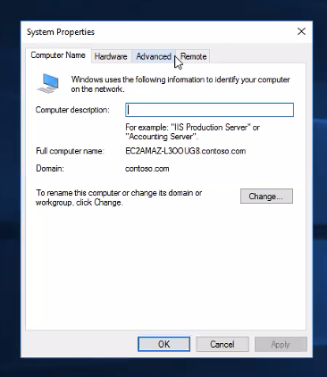
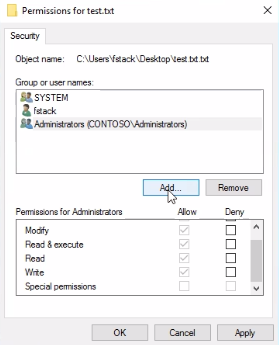
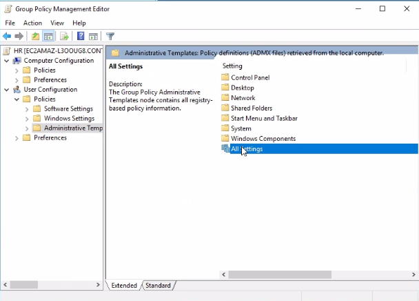
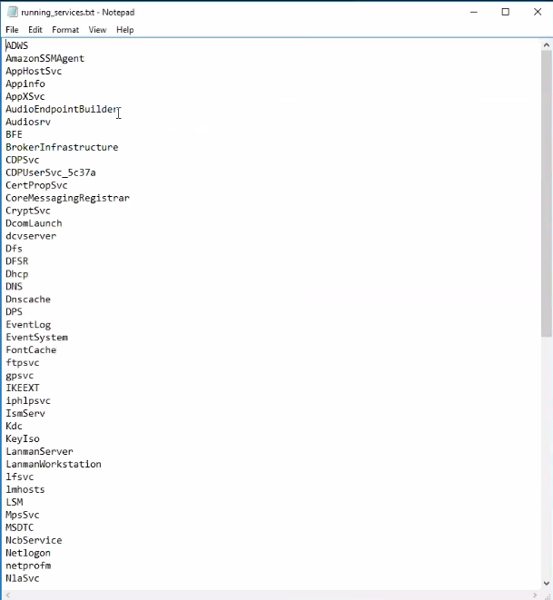

# Active Directory Runbook

**Name of the new hire:** Toby Flenderson  
**Role at StackFull Software:** Social Media Associate  
**Department:** HR

---

This runbook documents the steps required to provision a new user in Active Directory, apply security group permissions, create network shares, enforce group policy, and validate the outcome through logs and PowerShell.

Each section is directly aligned with a screenshot from the original `.docx` document.

---

## Join the computer to the domain
1. Log in as local administrator (`administrator` / `Pa$$w0rd`)
2. Open Control Panel > System and Security > System
3. Click Change settings > Change...
4. Select domain and enter `contoso.com`
5. Enter domain credentials
6. Restart the machine





## Create a new user
1. Open Active Directory Users and Computers (ADUC)
2. Navigate to the Users container
3. Right-click > New > User
4. Enter name: Toby Flenderson
5. Set a password (require change at next login)
6. Finish wizard


## Create a group named HR
1. Open Computer Management
2. Expand Local Users and Groups > Groups
3. Right-click > New Group
4. Name: HR
5. Add Toby Flenderson to the group


## Create a share for HR
1. Create a folder named `HR_Share`
2. Right-click > Properties > Sharing > Advanced Sharing
3. Enable sharing, name: `HRShare`
4. Permissions: remove Everyone, add HR group, Full Control
5. Create a test file in the folder


## Create an Organizational Unit
1. In ADUC, right-click domain > New > Organizational Unit
2. Name: HR
3. Move user and group into the OU


## Apply Group Policy to HR OU
**Logon Banner**
- GPMC > New GPO > Edit
- Computer Configuration > Windows Settings > Security Settings > Local Policies > Security Options
- Configure interactive logon message


**Disable CMD prompt**
- User Configuration > Admin Templates > System > Prevent access to the command prompt




**Map network drive via script**
- User Configuration > Windows Settings > Scripts (Logon/Logoff)
- Add script:
```bat
net use H: \\servername\HR
```


**Remove Run menu**
- User Configuration > Admin Templates > Start Menu and Taskbar > Remove Run menu from Start Menu


## Check login logs
- Open Event Viewer > Security Logs
- Filter for Event ID 4624


## PowerShell: Most recently installed program
```powershell
Get-WmiObject -Class Win32_Product |
Sort-Object InstallDate -Descending |
Select-Object Name, Version, InstallDate -First 1
```


## PowerShell: Running services
```powershell
Get-Service |
Where-Object {$_.Status -eq "Running"} |
Out-File "running_services.txt"
```


## Confirm GPO drive mapping





## Confirm GPO disables Run menu


## Final OU & GPO validation


## Validation screenshots



