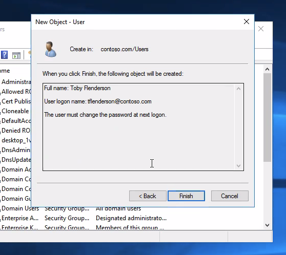

# Active Directory Runbook

**Name of the new hire:** Toby Flenderson  
**Role at StackFull Software:** Social Media Associate  
**Department:** HR

---

This runbook outlines a series of steps to set up and manage a Windows domain environment. It includes procedures for domain joining, user and group setup, resource sharing, GPO configuration, and system monitoring.

---

## 🖥️ Step 1: Join the Computer to the Domain
1. Log in as `administrator` and open **System Properties**.
2. Click `Change settings > Change` to modify computer name/domain.
3. Select `Domain`, enter `contoso.com`, and authenticate.
4. Restart the computer after confirmation.


---

## 👤 Step 2: Create a User for the New Hire
1. On the server, open **Active Directory Users and Computers**.
2. Navigate to `contoso.com > Users`, right-click > `New > User`.
3. Fill out user info, set a password, and finish the wizard.


---

## 👥 Step 3: Create a Group with the Department Name
1. In ADUC, right-click `Users` > `New > Group`.
2. Enter group name (e.g., HR) and confirm.
3. Open group > `Members > Add`, include the new user.


---

## 📁 Step 4: Create a Share on the Server
1. Create a folder for the department (e.g., HR).
2. Right-click > `Properties > Sharing > Advanced Sharing`.
3. Set share name and permissions for the HR group.
4. Place a `test.txt` file inside for validation.


---

## 🗂️ Step 5: Create an Organizational Unit (OU)
1. In ADUC, right-click the domain > `New > Organizational Unit`.
2. Name the OU (e.g., HR) and click OK.
3. Drag the user and group into the OU.





---

## 🛡️ Step 6: Configure Group Policy
### A. Display a Startup Message
1. Open GPMC and create/edit a GPO linked to the OU.
2. Navigate to `Computer Configuration > Policies > Windows Settings > Security Settings > Local Policies > Security Options`.
3. Enable UAC policy.


### B. Restrict Command Prompt
Navigate to:  
`User Configuration > Administrative Templates > System > Prevent access to command prompt`


### C. Add a Logon Script
1. Navigate to: `User Configuration > Windows Settings > Scripts (Logon/Logoff)`.
2. Add a `.bat` file to map the HR share.


### D. Disable the Run Command
Navigate to:  
`User Configuration > Administrative Templates > Start Menu and Taskbar > Remove Run menu`


---

## 📊 Step 7: Check Last Login via Event Viewer
1. Open Event Viewer.
2. Go to `Windows Logs > Security`.
3. Filter for `4624` event ID for successful logons.


---

## 💻 Step 8: Use PowerShell to Check Latest Installed Program
Run this in PowerShell:
```powershell
Get-WmiObject -Class Win32_Product |
  Sort-Object InstallDate -Descending |
  Select-Object Name, Version, InstallDate -First 1
```


---

## ⚙️ Step 9: List Running Services with PowerShell
Run the following script:
```powershell
Get-Service |
  Where-Object {$_.Status -eq "Running"} |
  Out-File "running_services.txt"
```


---

By following this runbook, domain administrators can confidently onboard users, delegate permissions, enforce policy, and maintain secure, structured network operations.
