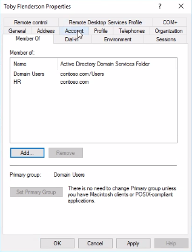

# Active Directory Runbook

**Name of the new hire:** Toby Flenderson  
**Role at StackFull Software:** Social Media Associate  
**Department:** HR

---

This runbook outlines a series of tasks related to user and group management, file sharing, OU creation, GPO configuration, and system monitoring for a Windows domain environment.

---

### Step 1: Join the Computer to the Domain
1. Log in using the local administrator account (username: `administrator`, password: `Pa$$w0rd`).  
2. Go to Control Panel > System and Security > System.  
3. Click “Change settings” next to the computer name.  
4. Click the “Change…” button.  
5. Select “Domain” and enter `contoso.com`.  
6. Enter domain admin credentials when prompted.  
7. Restart the computer to apply the domain join.

  
  
  
  


### Step 2: Create a New User in Active Directory
1. Open **Active Directory Users and Computers**.  
2. Expand the domain node and click on the **Users** container.  
3. Right-click **Users** > New > User.  
4. Fill in first name, last name, and username.  
5. Set an initial password and enforce password change on next logon.  
6. Click **Finish** to complete the wizard.  
7. Confirm that the new user appears in the list.

  
  
  
  
  


### Step 3: Create a Local Security Group
1. Open **Computer Management**.  
2. Expand **Local Users and Groups > Groups**.  
3. Right-click **Groups** > New Group.  
4. Name the group (e.g., `HR`).  
5. Click **Add** and add the user created in Step 2.  
6. Click **Create**, then **Close**.

  
  
  


### Step 4: Create a Share on the Server
1. On the server, create a folder (e.g., `HR_Share`).  
2. Right-click the folder > **Properties**.  
3. Go to the **Sharing** tab > **Advanced Sharing**.  
4. Check “Share this folder” and name it (e.g., `HRShare`).  
5. Click **Permissions**. Remove “Everyone”. Add the `HR` group and grant **Full Control**.  
6. Click OK and close all dialogs.  
7. Create a test file in the folder.

  
  
  
  
  


### Step 5: Create an Organizational Unit (OU)
1. Open **Active Directory Users and Computers**.  
2. Right-click the domain root > New > Organizational Unit.  
3. Name the OU (e.g., `HR`).  
4. Drag the user and group into the new OU.

  
  
  


### Step 6: Apply GPO Settings to the OU
#### Startup Message
1. Open **Group Policy Management**.  
2. Create and link a new GPO to the OU.  
3. Edit the GPO > Computer Configuration > Windows Settings > Security Settings > Local Policies > Security Options.  
4. Configure “Interactive logon: Message title” and “Message text”.

  
  


#### Disable Command Prompt
1. Navigate to User Configuration > Administrative Templates > System.  
2. Enable “Prevent access to the command prompt”.

  


#### Add a Logon Script
1. Go to User Configuration > Windows Settings > Scripts (Logon/Logoff).  
2. Add a `.bat` script to map the share:  
```bat
net use H: \\servername\\HR
```

  
  


#### Remove Run Menu
1. Navigate to User Configuration > Administrative Templates > Start Menu and Taskbar.  
2. Enable “Remove Run menu from Start Menu”.

  


### Step 7: Review Login Events
1. Open Event Viewer > Windows Logs > Security.  
2. Filter for Event ID **4624** to find successful login events.

  


### Step 8: PowerShell – Most Recently Installed Program
```powershell
Get-WmiObject -Class Win32_Product |
Sort-Object InstallDate -Descending |
Select-Object Name, Version, InstallDate -First 1
```


### Step 9: PowerShell – Running Services
```powershell
Get-Service |
Where-Object {$_.Status -eq "Running"} |
Out-File "running_services.txt"
```


### Step 10: Map the HR Share via GPO Script
1. In GPMC, go to User Configuration > Windows Settings > Scripts (Logon).  
2. Add the `.bat` script from earlier that maps the network drive.  
3. Confirm it is added and applied.

  
  
  
  
  
  


### Step 11: Disable Run Menu via GPO
1. Open GPMC and edit the OU-linked GPO.  
2. Navigate to User Configuration > Admin Templates > Start Menu and Taskbar.  
3. Enable “Remove Run menu from Start Menu”.

  
  
  


### Step 12: Final GPO and OU Verification
1. Verify GPO link in GPMC.  
2. Confirm correct user and group placement inside the OU.

  


### Step 13: Validation Screens
**GPO linked in GPMC:**  


**Logon script executed on login:**  


**Policy applied to user:**  


**Network drive mapped (H:) via script:**  


**User/group listed in correct OU:**  


**Event ID 4624 (login success):**  


**Running services (part 1):**  


**Running services (part 2):**  


**Manual execution of logon script:**  


**Final config overview:**  

